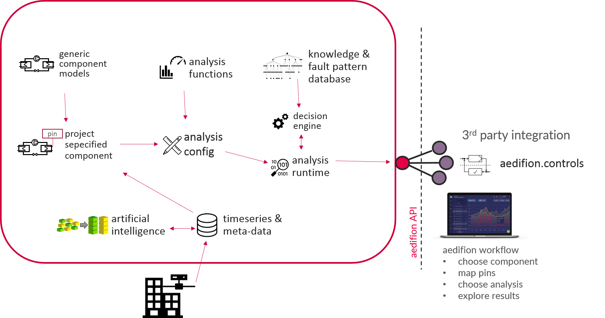

# aedifion.analytics

## Overview

aedifion.analytics is a data-driven service for deep analysis of heating, ventilation & air conditioning \(HVAC\) systems, energy-related plants, buildings, as well as energy networks such as district heating and cooling grids. This service is an embedded API functionality of the aedifion.io cloud platform. 

The goal of analytics is to support technicians and engineers who want to optimize \(or commision\) theses systems in respect of indoor comfort, energy efficiency, and maintenance expenditure. For this purpose, aedifion.analytics creates a profound transparency and interpretation of system operation. 

 Its configuration and analysis workflow is straightforward:

1. Choose the [components ](aedifion.analytics.md#components)of the energy system.
2. [Map datapoints](aedifion.analytics.md#mapping) to components with the help of the AI meta-data service of aedifion.
3. Choose [analysis functions](aedifion.analytics.md#analysis-functions) of interest to [configure analysis](aedifion.analytics.md#analysis-config) on the chosen components.
4. Get and [explore analytics results](aedifion.analytics.md#explore-analysis-results).

### Components

Analysis functionality is offered component wise. Therefore, choose the components of interest from the growing library of components, e.g., the component _boiler_. These components are generic data models which describe the link between individual data points and specific plants, e.g., the link of the component _boiler_ to its _supply temperature_ and _return temperature_ sensor. This generic link is called _pin._

_Learn more? Explore the_ [_available components_](engineers/specifications/analytics.md) _and_ corresponding __[_API endpoints_](developers/api-documentation/guides-and-tutorials/analytics.md)_._

### Mapping

To adjust a [generic component model](aedifion.analytics.md#components) to a specific project it only requires the mapping of datapoints to the corresponding pins of this component. The [data management functionalities](aedifion.io/features.md#data-management-and-structuring) and [meta-data](aedifion.io/features.md#meta-data) available on aedifion.io are supporting this process.

_Learn more? Try the_ [_API tutorial._](developers/api-documentation/guides-and-tutorials/analytics.md)\_\_

### Analysis functions

### Analysis config

### Knowledge & fault pattern databse

### Decision engine

### Analysis runtime

### Explore analysis results

### 

### 

