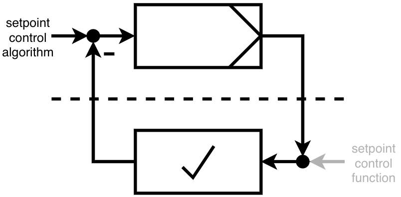
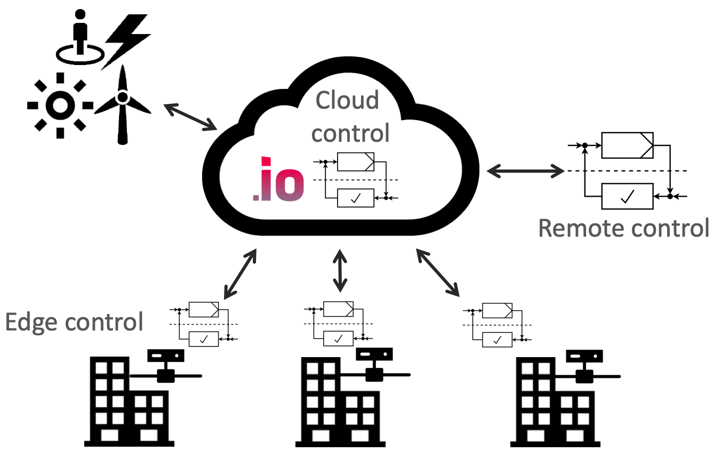

# aedifion.controls

## Introduction

aedifion.controls consists of virtually embedded control algorithms that can be operated edge- and cloud-based.

In future, the user can choose control algorithms from the aedifion control library and set it up by adding parameters, system outputs and controller outputs/manipulated variables. The algorithm is then operated as-a-service within aedifion.io. All interaction will be available via API.

For now, aedifion staff sets up the control algorithms from the aedifion control library according to the users need.

In the following we introduce control functionalities and algorithms in more detail. Visit [control specifications](engineers/controls.md) on in-depth information on the offered control algorithms.

## Control algorithms with feedback usage.

Control algorithms are defined as automatically generated actions with feedback usage.

In the meaning of the classic control theory, control algorithms are defined as closed loop control systems. Find a schematic diagram of such a system below. The difference between the feedback of the controlled system and the setpoint is the input to the system's controller. The generated algorithms output is the input to the controlled system.

Find the detailed descriptions of our currently available control algorithms [here](engineers/controls.md).

## Place of implementation

aedifion.controls enables remote and cloud control. Moreover, aedifion tailors edge control solutions if required. See the schematic below for a basic differentiation of these control concepts.

#### Remote control

Using the remote control functionalities, you can directly operate local plants via the [aedifion.io](aedifion.io/) platform, e.g. by self-hosted control algorithms, by control functionalities or even manually via API.

#### Cloud control

aedifion.controls features various control algorithms that we operate within the aedifion.io platform. See section[ control algorithms](engineers/controls.md) for an introduction of available control algorithms.

As custom service, aedifion deploys and hosts your proprietary control algorithms as cloud control algorithm. It is now possible to easily manage your estate and buildings in order realize an overall demand side management. Please do not hesitate to [contact us](contact.md) to discuss your needs. 

#### Edge control

In edge control, control algorithms run directly on the aedifion edge device. This accounts for low communication latency. At the same time, it lowers the risks of down times due to communication issues between the edge device and the cloud.

### Deployment scenarios

Control algorithms can be operated in different ways. A cloud-operated algorithm uses the internet to communicate its control decisions or manipulated variables. Contrary, an edge-operated algorithm is executed locally on the aedifion.io edge device within the customer's control system and only requires Internet connectivity to receive commands and updates. An air-gapped deployment is a more classical set up, quite like a local programmable logic controller, but with a more advanced control runtime, offering the possibility to execute more complex controls, including optimizations and simulations.

_This documentation continues with an introduction of aedifion.custom._ 

