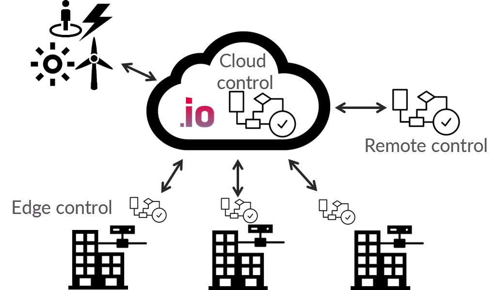

# aedifion.controls

## Introduction

aedifion.controls enables remote and cloud control. Moreover, aedifion tailors edge control solutions if required. See the schematic below for a basic differentiation of these control concepts.

### Remote control

Using the remote control functionalities, you can directly operate local plants via the aedifion.io platform, e.g. by self-hosted control algorithms, by control applications or even manually via API.

### Cloud control

aedifion.controls features various control algorithms that we operate within the aedifion.io platform. See section[ control algorithms](aedifion.controls.md#control-algorithms) for an introduction of available control algorithms.

As custom service, aedifion deploys and hosts your proprietary control algorithms as cloud control algorithm. Please do not hesitate to contact us to discuss your needs. 

### Edge control

In edge control, control algorithms run directly on the aedifion edge device. This accounts for low communication latency. At the same time, it lowers the risks of down times due to communication issues between the edge device and the cloud. 

## Control functionalities

high level summary of [controls](tutorials/api/setpoints-and-schedules.md)

setpoints

schedules

managing write access

querying, updating, deleting...

## Control algorithms

just 30,000 ft introduction here. Structure e.g.:

* what
* how
* in order to

Detailed description [here](engineers/specifications/controls.md).

### MaxPhi

This function optimizes the energy-efficiency and therefore the cost-efficiency of your Air Handling Unit \(AHU\) which contains Variable Air Volume \(VAV\)-Boxes. 

Standard AHU are controlled by a constant pressure- or volumeflow setpoint. Depending on this given plant sate the subsequent VAV-Boxes for e.g. room-automation reduce this volumeflow to the respective room dependent setpoint. Because the systems pressure- or volumeflow setpoint is selected for a full-load operation mode, in a partial-load operation mode, where the VAV-Boxes are partially closed, the AHU is not working efficiently. 

Here comes this higher-level control algorithm to place. The inputs are the continuously retrieved feedback signals of the VAV-Boxes in percent. With the maxima of those feedbacks, the setpoints of the extract \(ETA\) and supply \(SUP\) air ventilators are being calculated.

### Basic heat curve optimization

This function optimizes the supply temperature of heating circuits in your building using forecasted data of ambient air temperature.

In state of the art building automation systems the supply temperatures of standard heating circuits are calculated depending on the actual ambient air temperature. The relation between those two temperatures is called heating curve. 

The Basic heat curve optimization algorithms takes the influences of forecasted ambient air temperature and the thermal storage of the buildings mass into account and calculates a new hypothetical ambient air temperature. This temperature is then the input of the standard heating curve which itself gives back the setpoint of the supply temperature of the heating circuit.

### Integration of Microsoft Exchange calendar

With this function meeting rooms can be handled by their actual scheduled needs which are retrieved from the MS Exchange calendar function via an API-based connection. Some time before the meeting starts the Variable Air Volume \(VAV\)-Boxes open and the stagnant air is getting replaced by fresh air. 

With this algorithm you meet energy efficiency circumstances, because the meeting room is only treated when it is actually being used as well as demands on human comfort in terms of air quality. 

### Free night cooling

In state of the art Air Handling Units controlled by Building Automation Systems, air cooling is happening only on demand. Overnight Cooling of the buildings mass in prediction of a relatively higher ambient temperature over day saves energy costs in terms of using the 'free' cool air and saving cooling power later on. Because of high recovering rates of standard heat recovering units the cool room temperature inside can be used to take the heat ingress out of the outdoor air which is needed in terms of air quality control.

If you have ideas for other control features or want to discuss your usecase, feel free to [contact us](contact.md).

