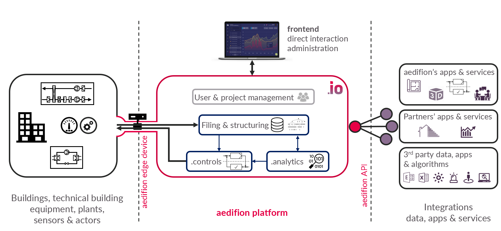

# aedifion.io

## Overview

aedifion.io is an IoT platform tailored to monitoring and optimizing heating, ventilation & air conditioning \(HVAC\) systems, energy-related plants, as well as energy networks such as district heating and cooling grids. The main goal is to provide a one-stop solution for energy and cost efficient system operation with high effectiveness \(in terms of need fulfillment, e.g., thermal comfort, indoor air quality, and other generic energy services\). The leading use case of the aedifion.io platform is to connect to a local plant, discover, collect, and store all available data, apply analytic algorithms to uncover optimization potential, and use controls to optimize local plants' operation based on these insights.

We introduce the main ingredients of the aedifion.io platform in the following, along the schematic overview of the aedifion.io ecosystem illustrated in the figure above. 

The core aedifion.io platform \(middle\) provides data filing and processing, AI & domain specific [analytics](../aedifion.analytics.md), [control functionalities & algorithms](../aedifion.controls.md), data management and structuring, role-based user and access management, as well as other [features](features.md), all dedicated to the operation and optimization of energy system.

The aedifion [edge device](gateway.md) \(middle left\) provides plug-and-play connectivity to building automation and control systems \(far left\) and to automation systems of energy-related plants, such as e.g. larger scale combined heat and power plants, air handling units, heat pumps, etc.

The aedifion [frontend ](frontend.md)\(top\) is a browser-based human machine interface \(HMI\). It offers data visualization, data management, platform administration and provides access to various further [features](features.md).

aedifion.io's [application programming interfaces ](apis.md)\(APIs, middle right\) offer access to all mayor platform features and functionalities. You can operate the platform directly over these APIs and/or connect your own programs and scripts to it. 

Based on the APIs, aedifion offers various native applications \(far right\), e.g., a floor plan app and a [3D HMI](integrations.md#3d-hmi), as well as services like control algorithm development, and custom-purpose AI development. Furthermore, aedifion's partners use aedifion.io to offer building, multi-building and district-wide energy management as well as building performance optimization as-a-service.

aedifion.io integrates various 3rd party data sources such as [weather predictions](integrations.md#weather-data) and [Microsoft Exchange](integrations.md#microsoft-exchange) calendars, connects to 3rd party platforms and [cloud services](integrations.md#cloud-services), such as Cumulocity, and can be integrated into 3rd party applications, such as [Microsoft Excel](integrations.md#excel) or [Grafana](https://grafana.com/).  Moreover, [chat bots](integrations.md#chatbots) for external messaging systems like Telegram, Teams, or Slack can serve as output channels for aedifion.io's alarming system.

## Further products

Beyond the native features of the aedifion.io platform [outlined above](./#overview), aedifion is building the following further products that all use aedifion.io as their base technology.

[aedifion.analytics](../aedifion.analytics.md) features deep analytics for technical equipment within your plant. It focuses on the calculation of key performance indicators for components within local plants and the derivation of recommendations for action. See [aedifion.analytics](../aedifion.analytics.md) for detailed information.

[aedifion.controls](../aedifion.controls.md) provides a framework of basic control functionalities that are a prerequisite for modern controls as well as predefined control algorithms, such as optimizer for air handling unit operations or MS Exchange augmented room controls. See [aedifion.controls](../aedifion.controls.md) for detailed information

aedifion.custom adapts .io, .analytics, and .controls to your needs with e.g. picked modules and functionalities as well as tailored APIs. [Contact us](../contact.md) to discuss your requirements.

## aedifion.io in detail

Within the next subpages, you will find more in-depth information about the different features and components that make up the aedifion.io platform for energy system operation and optimization:

* [Features ](features.md)gives an overview of all relevant key functionalities of aedifion.io. 
* [Edge device](gateway.md) explains what the edge device is and how it works.
* [APIs](apis.md) introduces the aedifion.io’s APIs. 
* [Frontend](frontend.md) introduced introduces the main platform HMI.
* [Data](data/) explains the main specifications of used data models.
* [Integrations](integrations.md) describes integrations to aedifion.io
* [Security ](security.md)discusses aedifion's approaches to deliver high ICT security.

