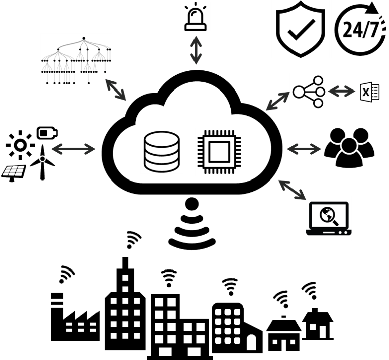

# aedifion.io

## Introduction

aedifion.io offers plant-, building- and district-wide [data acquisition](https://docs.aedifion.io/docs/aedifion.io/features#advanced-data-ingress) based on IP technology.


aedifion.io works fully plug-and-play for BACnet system. All it needs is a gateway that operating personnell can easily connect to local networks. 


Once acquired, it stores data in time series databases guaranteeing for highest performance within data retrieval and processing. It offers computational power to process data and has a flexible data provisition concept. Comprehensive APIs make it easy to integrate many different applications, such as e.g. MS Excel, Matlab, Amazon's Alexa, or your favourite data processing tool or programming language. It offers the possibility to integrate many different thrid party data sources, such as e.g. weather forecasts, MS Exchange. aedifion.io provides different data visualization dashboards which can be individually customized. 

It generates notifications and alarms based on concepts, such as e.g. "threshold" and "throughput", whith various channels, such as E-Mail, Telegram, Slack, or even MQTT.

As aedifion.io originates from research, it has profound data structuring concepts to cope for meta data management, multiple datapointkey, and semantic modelling of energy system structures. 

aedifion.io enables remote control for each connected system. Control algorithms can also be integrated into the aedifion.io cloud platform or into its edge devices with customized APIs. 

Its desing fulfully highest ICT security standards and data privacy requirements according to the EU General Data Protection Regulation \(GDPR\). In order to gerneratre trust regarding privacy, aedifion provides a complete legal framework with aedifion.io.

aedifion.**io** enables building and district-wide as well as plant-specific acquisition of operational data, data transfer and storage as well as location-, device- and platform-independent data retrieval. Furthermore, aedifion.**io** offers data management functions and various visualization options. aedifion.io offers access control and fine-grained user, role and rights management in accordance with recent IT security standards. This comprises a web server certification, a complete TLS encryption of the data transfer as well as a user authentication mechanism. 

The alarm system integrated in aedifion.**io** allows different types of alarms to be set up flexibly for individual data points or entire projects. Alarm messages can be sent via various output channels, such as email or the usual instant messengers. In addition, Alarm messages can be sent via various output channels, such as email or the usual instant messengers. 

Furthermore, aedifion.**io** enables the merging of data from different sources, for example from different building automation manufacturers, weather data providers or other devices installed in buildings. Room occupancy lists can also be integrated, for example via Microsoft Exchange. With aedifion.io, data can be made accessible at a central location, especially across buildings and properties. 

aedifion.**io** offers a high-performance writing functionality with which setpoints can be set remotely or system controllers can be overwritten by cloud-based controllers. This feature also makes it possible to define long-lasting schedules that guarantee reliable and consistent control of the building even if internet connectivity is lost.

## Use Cases

aedifion.io can be used in various ways. In the following you find typical use cases.

### Technical Monitoring \(VDI 6041, AMEV\)

### Energy Management \(ISO 50 001\)

### Data Management

### Big Data analytics

### Middelware for App development

### Control applications

