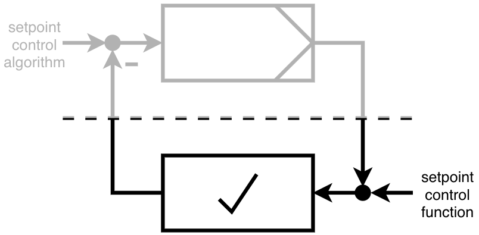

# Basic control functionalities

aedifion.io provides basic control functionalities whenever a datapoint is generally controllable in a field  and BAS is one of the supported automation networks described in the [data ingress section](features.md#data-ingress). These functions are working manufacturer-independent. 

Control functionalities are defined actions with no automatic feedback usage, like:

* writing setpoints, e.g. turning ventilation on or defining the reference for a closed control loop like a volume flow control algorithm;
* defining and monitoring schedules, which is a set of various time-dependent setpoints that is executed robustly on the edge device, e.g. turning ventilation on and off according to if it is a weekday or weekend;
* defining simple fallback functionalities, e.g. in case a sensor is broken, open a certain valve;
* overwriting and simulating analog inputs for BACnet IP-based BAS, e.g. overwriting an ambient temperature.

Therefore control functionalities conform to the meaning of classic control theory open loop control systems. In the picture below you can see such a system. The controlled system has a setpoint input, but the output of the system is not being used to generate the next input.

To get an overall idea of how to use the control functionalities please check this high level summary of API-based [controls](../developers/api-documentation/guides-and-tutorials/setpoints-and-schedules.md).


In extreme cases, local control hardware can be reduced to in-out-devices whereas all logic is operated in the cloud.



Safety of cloud-based controls is critical. aedifion.io offers various, locally executed, safety mechanisms that handle, e.g., connection loss, crashes, and human error.


_This documentation continues with a discussion of IT security and our approaches towards it._