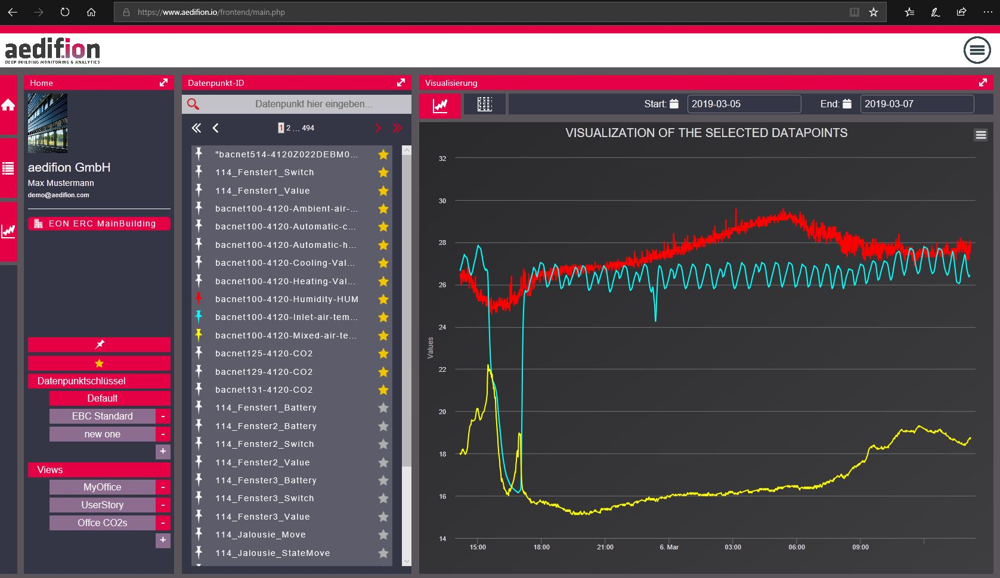

# Frontend

## Overview

At the moment, aedifion provides a beta version of its web frontend offering access to some functionalities of aedifion.io, i.e. data exploration and limited data management, such as plotting, saving and calling saved plots, so-called views, adding favorites, adding [datapoint keys](../glossary.md#datapointkey) and renaming [datapoints](../glossary.md#datapoint).


aedifion is currently developing an all-new frontend for holistic platform management and data access. 


## Data exploration

The frontend visualizes historical data and almost real time data using line and heat map plots. It plots up to seven lines in one line plot. One datapoint at a time can be plotted as heat map.

The datapoint list is searchable.

The frontend supports switching projects as soon as one user has access to multiple projects.

## Saved views

After a user has generated a certain plot, he can add this plot to his so-called "saved views". This guarantees for easy-access to the most important views.

## Favorites

A datapoint can be marked as favorite. Once marked, the datapoint list can be sorted by favorites. Each favorite will be pinned at the top end of the list. This serves for easy access to the most important datapoints.

## Datapoint keys

The frontend supports multiple [datapoint keys](../glossary.md#datapointkey). A user can add new datapoint keys and can rename each datapoint. He can alter the datapoints list by datapoint keys.

## Meta data

Within the datapoint list, the frontend shows available meta data for each datapoint. 

_This documentation continues with an introduction of the used data models in aedifion.io_

