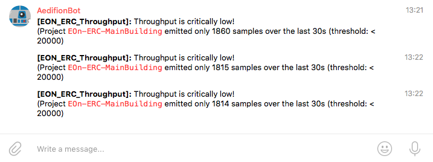
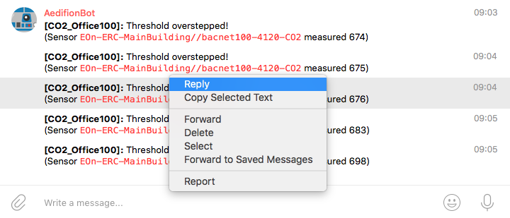
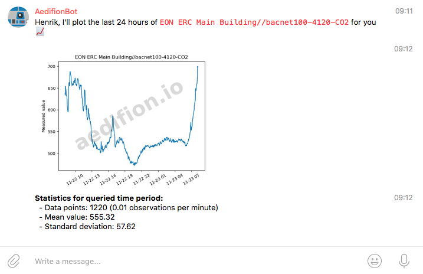
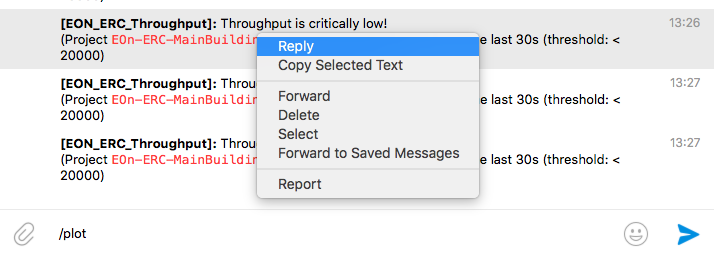
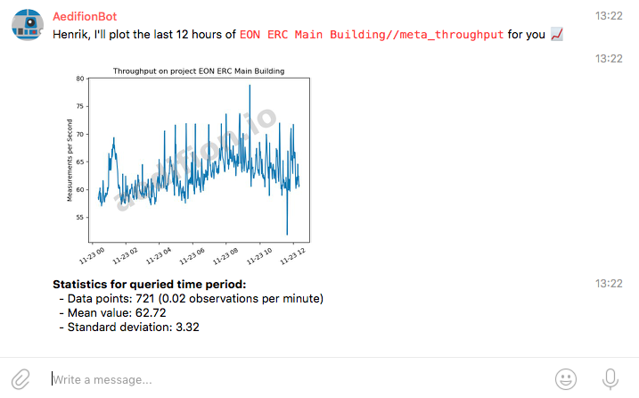

# Alarming

## Overview

In this article, you will learn how to set up alarms on time series and meta-data on the aedifion.io platform. Currently, the aedifion.io platform supports two types of alarms: i\) alarms on the observations for a datapoint and ii\) alarms on the throughput \(i.e., received observations per time interval\) of a certain datapoint or whole project \(please refer to our [Glossary](../../../glossary.md) if the terms datapoint and observation seem strange to you\). You will specify one of each and configure it to send out notifications on alarm events via the Telegram instant messenger or email.

### Preliminaries

The examples provided in this article partly build on each other. For the sake of brevity, boiler plate code such as imports or variable definitions is only shown once and left out in subsequent examples.

To execute the examples provided in this tutorial, the following is needed:

* A valid login \(username and password\) to the aedifion.io platform. If you do not have a login yet, please [contact us](../../../contact.md) regarding a demo login. The login used in the example will not work!
* A project with live data ingress.
* Optionally, a working installation of [Python](https://www.python.org/) or [Curl](https://curl.haxx.se/).

## Types of alarms

The aedifion.io platform supports two versatile types of alarms:

* _Threshold alarms_ are defined on single datapoints and trigger an alarm whenever the measured values for that datapoint exceed \(or fall below\) a certain threshold. A typical use case for threshold alarms is notifying about unwanted system conditions such as high CO2 concentration in offices.
* _Throughput alarms_ are defined on single datapoints or whole projects and trigger an alarm whenever the measured throughput for that datapoint or project falls below a certain threshold. Thresholds can be set at three different levels to indicate the severity of missing throughput. Typical use cases for throughput alarms is fault detection by monitoring of the operational health of the building automation systems, e.g., alerting about the unscheduled shut-down of a critical component or notifying when a sensor is dead.

Further types of alarms will be added in future. If you have a special request, please [contact us](../../../contact.md).

## Adding alarms

A new alarm is created through the `POST /v2/project/{project_id}/alert` endpoint. The parameters that specify the alarm must be encoded as a [JSON](https://www.json.org/) object and send in the body of the request. Since the list of parameters is quite involved, we start with the set of parameters for threshold alarms.

### Adding a threshold alarm

Threshold alarms are defined through the following parameters.

<table>
  <thead>
    <tr>
      <th style="text-align:left">Parameter</th>
      <th style="text-align:center">Datatype</th>
      <th style="text-align:center">Type</th>
      <th style="text-align:center">Required</th>
      <th style="text-align:left">Description</th>
      <th style="text-align:left">Example</th>
    </tr>
  </thead>
  <tbody>
    <tr>
      <td style="text-align:left"><b>name</b>
      </td>
      <td style="text-align:center">string</td>
      <td style="text-align:center">body (JSON)</td>
      <td style="text-align:center">yes</td>
      <td style="text-align:left">The name of the new alarm. The name needs to be unique within the project
        scope.</td>
      <td style="text-align:left">CO2_Office-100</td>
    </tr>
    <tr>
      <td style="text-align:left"><b>alert_<br />type</b>
      </td>
      <td style="text-align:center">string</td>
      <td style="text-align:center">
        <p>body</p>
        <p>(JSON)</p>
      </td>
      <td style="text-align:center">yes</td>
      <td style="text-align:left">The type of the alarm, either &apos;threshold&apos; or &apos;throughput&apos;.</td>
      <td
      style="text-align:left">threshold</td>
    </tr>
    <tr>
      <td style="text-align:left"><b>telegram_<br />chatid</b>
      </td>
      <td style="text-align:center">string</td>
      <td style="text-align:center">body (JSON)</td>
      <td style="text-align:center">no</td>
      <td style="text-align:left">The id of a Telegram chat where notifications are sent to when the alarm
        is triggered (must be a chat that involves @aedifion_bot)</td>
      <td style="text-align:left">-219643311</td>
    </tr>
    <tr>
      <td style="text-align:left"><b>email</b>
      </td>
      <td style="text-align:center">string</td>
      <td style="text-align:center">
        <p>body</p>
        <p>(JSON)</p>
      </td>
      <td style="text-align:center">no</td>
      <td style="text-align:left">A comma-separated list of email recipients to which notifications are
        sent when the alarm is triggered.</td>
      <td style="text-align:left">
        <p>john.doe@aedifion.com, jane.doe@aedifion.com,</p>
        <p>alarm@aedifion.com</p>
      </td>
    </tr>
    <tr>
      <td style="text-align:left"><b>dataPointID</b>
      </td>
      <td style="text-align:center">string</td>
      <td style="text-align:center">
        <p>body</p>
        <p>(JSON)</p>
      </td>
      <td style="text-align:center">yes</td>
      <td style="text-align:left">The alphanumeric id of the datapoint on which to send alarms.</td>
      <td
      style="text-align:left">bacnet100-4120-CO2</td>
    </tr>
    <tr>
      <td style="text-align:left"><b>threshold_<br />dead</b>
      </td>
      <td style="text-align:center">float</td>
      <td style="text-align:center">
        <p>body</p>
        <p>(JSON)</p>
      </td>
      <td style="text-align:center">yes</td>
      <td style="text-align:left">The threshold for observations below which the datapoint is considered
        dead, offline, or broken.</td>
      <td style="text-align:left">100</td>
    </tr>
    <tr>
      <td style="text-align:left"><b>threshold_<br />ok</b>
      </td>
      <td style="text-align:center">float</td>
      <td style="text-align:center">
        <p>body</p>
        <p>(JSON)</p>
      </td>
      <td style="text-align:center">yes</td>
      <td style="text-align:left">The threshold for observations below which the datapoint is considered
        in correct state and any active alarm is reset.</td>
      <td style="text-align:left">900</td>
    </tr>
    <tr>
      <td style="text-align:left"><b>threshold_<br />crit</b>
      </td>
      <td style="text-align:center">float</td>
      <td style="text-align:center">
        <p>body</p>
        <p>(JSON)</p>
      </td>
      <td style="text-align:center">yes</td>
      <td style="text-align:left">The threshold for observations above which the datapoint is considered
        to be in critical state.</td>
      <td style="text-align:left">1300</td>
    </tr>
    <tr>
      <td style="text-align:left"><b>threshold_<br />order</b>
      </td>
      <td style="text-align:center">string</td>
      <td style="text-align:center">
        <p>body</p>
        <p>(JSON)</p>
      </td>
      <td style="text-align:center">no</td>
      <td style="text-align:left">The order of the thresholds. &apos;asc&apos; as described, or &apos;desc&apos;
        to reverse the order, basically flipping all comparisons.</td>
      <td style="text-align:left">asc</td>
    </tr>
    <tr>
      <td style="text-align:left"><b>period</b>
      </td>
      <td style="text-align:center">string</td>
      <td style="text-align:center">
        <p>body</p>
        <p>(JSON)</p>
      </td>
      <td style="text-align:center">yes</td>
      <td style="text-align:left">The time period after which an alert is resent when in critical state
        (h = hours, m = minutes, s = seconds).</td>
      <td style="text-align:left">2h</td>
    </tr>
  </tbody>
</table>Have you noted the gap between the _threshold\_ok_ and _threshold\_crit?_ This is called a hysteresis. The alarm will enter critical state once observations exceed the _threshold\_crit_ then fire warnings every 2 hours until observations fall below _threshold\_ok._ Of course, you can set _threshold\_ok_ equal to _threshold\_crit_ if you want alarms to recover immediately when observations fall below the critical threshold.

Let's add the above alarm and see what happens.



```python
from requests import post, get, put, delete
project_id = 4
api_url = "https://api.aedifion.io"

newalert = {
    'name': 'CO2_Office100',
    'alert_type': 'threshold',
    'telegram_chatid': '-219643311',
    'email': 'john.doe@aedifion.com',
    'dataPointID': 'bacnet100-4120-CO2',
    'threshold_dead': 100,
    'threshold_ok': 900,
    'threshold_crit': 1300,
    'threshold_order': 'asc',
    'period': '2h'    
}

r = post(api_url + "/v2/project/{}/alert".format(project_id),
         auth=john,
         json=newalert)

print(r.text)
```



Coming soon 🐒



Coming soon 🐒



The JSON-formatted response confirms that the alarm was successfully created and returns the details of the alarm:

```javascript
{
    "success": true,
    "operation": "create",
    "resource": {
        "created": "2018-11-22T15:34:14.292927751Z",
        "dataPointID": "bacnet100-4120-CO2",
        "email": "john.doe@aedifion.com",
        "id": 6,
        "name": "CO2_Office100",
        "period":7200000000000,
        "project_id": 4,
        "status": "enabled",
        "telegram_chatid": "-219643311",
        "threshold_crit":1300,
        "threshold_dead":100,
        "threshold_ok":900
    }
}
```

Note that the alarm has received a unique numeric id \(6\), the period of 2 hours has been translated into nanoseconds, and it has already been enabled.

You may already receive alarms or try to provoke some by gathering a few people in your office or by directly breathing into the CO2 sensor. Otherwise, don't worry, we will later [modify the alarm](alarming.md#modifying-alarms) such that it will definitely trigger alarms even without having a party in your office. Before, we add an alarm of the second type, i.e., throughput.

### Adding a throughput alarm

Throughput alarms are defined through the following parameters.

<table>
  <thead>
    <tr>
      <th style="text-align:left"><b>Paramater</b>
      </th>
      <th style="text-align:center">Datatype</th>
      <th style="text-align:center">Type</th>
      <th style="text-align:center">Required</th>
      <th style="text-align:left">Description</th>
      <th style="text-align:left">Example</th>
    </tr>
  </thead>
  <tbody>
    <tr>
      <td style="text-align:left"><b>name</b>
      </td>
      <td style="text-align:center">string</td>
      <td style="text-align:center">
        <p>body</p>
        <p>(JSON)</p>
      </td>
      <td style="text-align:center">yes</td>
      <td style="text-align:left">The name of the new alarm. Needs to be unique within the project scope.</td>
      <td
      style="text-align:left">CO2_Office-100</td>
    </tr>
    <tr>
      <td style="text-align:left"><b>alert_<br />type</b>
      </td>
      <td style="text-align:center">string</td>
      <td style="text-align:center">
        <p>body</p>
        <p>(JSON)</p>
      </td>
      <td style="text-align:center">yes</td>
      <td style="text-align:left">The type of the alarm, either &apos;threshold&apos; or &apos;throughput&apos;.</td>
      <td
      style="text-align:left">threshold</td>
    </tr>
    <tr>
      <td style="text-align:left"><b>telegram_<br />chatid</b>
      </td>
      <td style="text-align:center">string</td>
      <td style="text-align:center">body (JSON)</td>
      <td style="text-align:center">no</td>
      <td style="text-align:left">The id of a Telegram chat where notifications are sent to when the alarm
        is triggered (must be a chat that involves @aedifion_bot)</td>
      <td style="text-align:left">-219643311</td>
    </tr>
    <tr>
      <td style="text-align:left"><b>email</b>
      </td>
      <td style="text-align:center">string</td>
      <td style="text-align:center">
        <p>body</p>
        <p>(JSON)</p>
      </td>
      <td style="text-align:center">no</td>
      <td style="text-align:left">A comma-separated list of email recipients to which notifications are
        sent when the alarm is triggered.</td>
      <td style="text-align:left">
        <p>john.doe@aedifion.com, jane.doe@aedifion.com,</p>
        <p>alarm@aedifion.com</p>
      </td>
    </tr>
    <tr>
      <td style="text-align:left"><b>dataPointID</b>
      </td>
      <td style="text-align:center">string</td>
      <td style="text-align:center">
        <p>body</p>
        <p>(JSON)</p>
      </td>
      <td style="text-align:center">no</td>
      <td style="text-align:left">The alphanumeric id of the datapoint on which to measure throughput. If
        not provided, throughput of the whole project is measured.</td>
      <td style="text-align:left">bacnet100-4120-CO2</td>
    </tr>
    <tr>
      <td style="text-align:left">
        <p><b>threshold_</b>
        </p>
        <p><b>info</b>
        </p>
      </td>
      <td style="text-align:center">float</td>
      <td style="text-align:center">
        <p>body</p>
        <p>(JSON)</p>
      </td>
      <td style="text-align:center">yes</td>
      <td style="text-align:left">First threshold below which throughput is considered slightly lower than
        usual.</td>
      <td style="text-align:left">50</td>
    </tr>
    <tr>
      <td style="text-align:left">
        <p><b>threshold_</b>
        </p>
        <p><b>warn</b>
        </p>
      </td>
      <td style="text-align:center">float</td>
      <td style="text-align:center">
        <p>body</p>
        <p>(JSON)</p>
      </td>
      <td style="text-align:center">yes</td>
      <td style="text-align:left">Second threshold below which throughput is considered significantly lower
        than usual.</td>
      <td style="text-align:left">20</td>
    </tr>
    <tr>
      <td style="text-align:left">
        <p><b>threshold_</b>
        </p>
        <p><b>crit</b>
        </p>
      </td>
      <td style="text-align:center">float</td>
      <td style="text-align:center">
        <p>body</p>
        <p>(JSON)</p>
      </td>
      <td style="text-align:center">yes</td>
      <td style="text-align:left">Third threshold below which throughput is considered critically low.</td>
      <td
      style="text-align:left">10</td>
    </tr>
    <tr>
      <td style="text-align:left"><b>period</b>
      </td>
      <td style="text-align:center">string</td>
      <td style="text-align:center">
        <p>body</p>
        <p>(JSON)</p>
      </td>
      <td style="text-align:center">yes</td>
      <td style="text-align:left">Time period over which to measure throughput (h = hours, m = minutes,
        s = seconds).</td>
      <td style="text-align:left">10m</td>
    </tr>
  </tbody>
</table>

```python
project_id = 4
api_url = "https://api.aedifion.io"

newalert = {
    'name': 'EON_ERC_Throughput',
    'alert_type': 'throughput',
    'telegram_chatid': '-219643311',
    'email': 'john.doe@aedifion.com',
    'threshold_info': 1000,
    'threshold_warn': 500,
    'threshold_crit': 100,
    'period': '30s'    
}

r = post(api_url + "/v2/project/{}/alert".format(project_id),
         auth=john,
         json=newalert)

print(f"{r.status_code} - {r.text}")
```







As usual, the confirmation comes with the response.

```javascript
{
    "success":true,
    "operation": "create",
    "resource": {
        "id":8,
        "created": "2018-11-23T12:08:43.994355154Z",
        "dataPointID": "bacnet100-4120-CO2",
        "email": "john.doe@aedifion.com",
        "name": "EON_ERC_Throughput", 
        "period":30000000000, 
        "project_id": 4,
        "status": "enabled",
        "telegram_chatid": "-219643311",
        "threshold_crit": 1000,
        "threshold_info": 500,
        "threshold_warn": 100
    }
}
```

We would now need to 

## Modifying alarms

The previous alarm might have been set to defensively and not trigger unless there is small party going on in your office. In order to provoke an alert, we now set a ridiculously low _threshold\_crit_ and also define a much shorter reminder period for the repetition of the alarms.



```python
alert_id = 6
updatealert = {
    'threshold_ok': 100,
    'threshold_crit': 200,
    'period': '30s'
}

r = put(api_url + f"/v2/project/{project_id}/alert/{alert_id}",
        auth=john,
        json=updatealert)

print(r.text)
```



Coming soon 🐒



Coming soon 🐒



The response confirms that the alarm has been updated as requested:

```javascript
{
    "success": true,
    "operation": "update",
    "resource": {
        "id":6,
        "created": "2018-11-22T15:34:14.292927751Z",
        "dataPointID": "bacnet100-4120-CO2", 
        "email": "john.doe@aedifion.com",
        "name": "CO2_Office100",
        "period": 30000000000,
        "project_id": 4,
        "status": "enabled",
        "telegram_chatid": "-219643311",
        "threshold_crit": 200,
        "threshold_dead": 100,
        "threshold_ok": 900
    }
}
```

You will soon see the alerts from @aedifion\_bot dropping in to your Telegram chat \(or to your mail account\).


We can also modify the throughput alarm with ridiculously high thresholds on throughput to provoke an alarm, e.g., `"threshold_crit": 20000`.`"threshold_warn": 50000` and `"threshold_info": 100000`.



## Plotting alarms in Telegram

When we receive an alarm, e.g., on Telegram, we want to get a quick idea of what triggered the alarm. The first thing is then to actually look at the time series. Conveniently, we can do this through @aedifion\_bot right there in Telegram where the alerts are received. 


Due to data privacy protection, the plotting feature must first be activated for your Telegram chat. Please [contact the technical support](../../../contact.md) in this matter.  If it is not yet activated you will receive an error message accordingly. 


### Plotting a threshold alarm

Follow the next four steps to plot the time series of a datapoint on which a threshold alert was triggered:

1. Right-click on one of the alarms and hit _Reply_



2. Reply to the selected alert with the message "/plot" \(messages starting with a slash `/` are interpreted as commands to the bot by the Telegram Bot API.\).

3. Select how much history you need.


  4. Wait for the plot to be generated and inspect it.



In this example, we can observe that CO2 level started to rise rapidly with the beginning of the workday. This is quite normal and nothing to worry about.

### Plotting a throughput alarm

You can also plot throughput in exactly the same manner as [plotting threshold alarms](alarming.md#plotting-a-threshold-alarm) - you only need to reply "/plot" to a throughput alarm notification sent by the bot.



As before, select the amount of history you need and wait for the plot be received.



## Pausing alarms

Since the alarm is now triggering notifications every 30 seconds, let's take a break and pause the alarm. The `PUT /v2/project/{project_id}/alert/{alert_id}/toggle` endpoint is a shorthand for this task.



```python
alert_id = 6
r = put(api_url + f"/v2/project/{project_id}/alert/{alert_id}/toggle", 
        auth=john)
print(r.text)
```



Coming soon 🐒



Coming soon 🐒



The response tells us that the alarm has been switched off.

```javascript
{
    "success": true,
    "operation": "update",
    "resource": "Alert switched off!"
}
```

Calling the endpoint a second time, would switch the alarm back on again. But let's leave it switched off for now.

## Listing alarms

You can list all alarms using the `GET /v2/project/{project_id}/alerts` endpoint.



```python
r = get(api_url + f"/v2/project/{project_id}/alerts")
print(r.text)
```



Coming soon 🐒



Coming soon 🐒



The answer is a list of alarms among which we find the one we defined previously. Note that it has `"status": "disabled"` because we paused it.

```javascript
[
   ...
    {
        "id":6,
        "created": "2018-11-23T08:28:43.526937933Z",
        "dataPointID": "bacnet100-4120-CO2",
        "email": "john.doe@aedifion.com",
        "name": "CO2_Office100",
        "period": 30000000000,
        "project_id": 4,
        "status": "disabled",
        "telegram_chatid": "-219643311",
        "threshold_crit":200,
        "threshold_dead":100,
        "threshold_ok":100
    },
    {
        "id":7,
        "created": "2018-11-23T12:08:43.994355154Z",
        "dataPointID": "bacnet100-4120-CO2",
        "email": "john.doe@aedifion.com",
        "name":"EON_ERC_Throughput",
        "period":30000000000,
        "project_id": 4,
        "status": "enabled",
        "telegram_chatid": "-219643311",
        "threshold_crit": 20000,
        "threshold_info":100000,
        "threshold_warn":50000
    },
  ...
]
```

## Deleting alarms

Deleting an alarm is a simple matter of calling `DELETE /v2/project/{project_id}/alert/{alert_id}`. As an example, we now delete the threshold alarm that we have previously created and modified.



```python
alert_id = 6 
r = delete(api_url + f"/v2/project/{project_id}/alert/{alert_id}", auth=john)
print(r.text)
```











The response confirms the deletion and returns the details of the deleted alarm.

```javascript
{
    "success": true,
    "operation": "delete",
    "resource": {
        "id":6,
        "created": "2018-11-23T08:28:43.526937933Z",
        "dataPointID": "bacnet100-4120-CO2",
        "email": "john.doe@aedifion.com",
        "name": "CO2_Office100",
        "period": 30000000000,
        "project_id": 4,
        "status": "disabled",
        "telegram_chatid": "-219643311",
        "threshold_crit":200,
        "threshold_dead":100,
        "threshold_ok":100
    }
}
```

Go ahead and delete also the throughput alarm then call `GET /v2/project/{project_id}/alerts`  to verify that both alarms are really gone.

 

