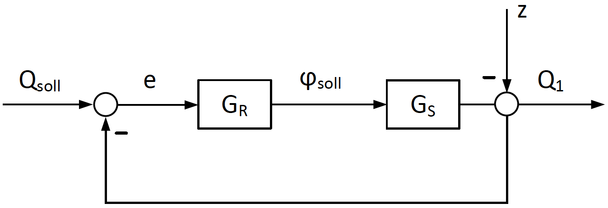
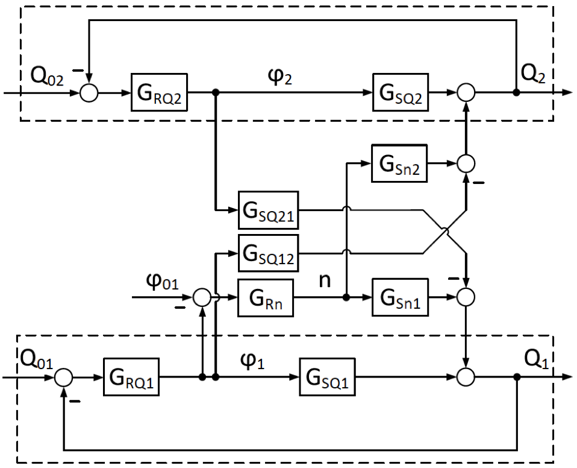
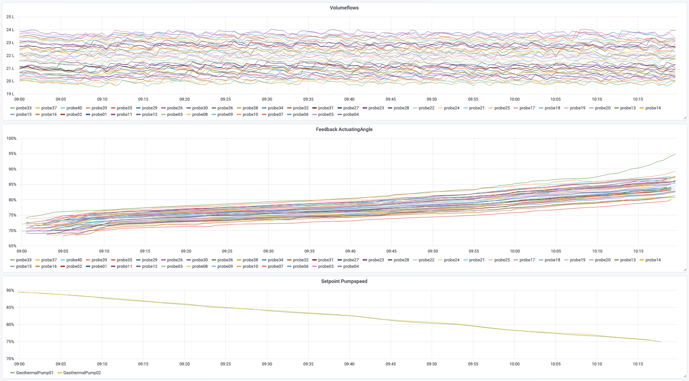
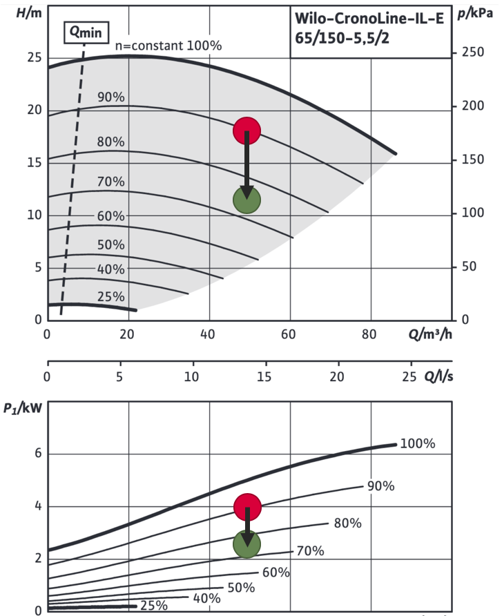

# Controls

## MaxPhi

### Description

This function optimizes the energy-efficiency and therefore the cost-efficiency of energy distribution systems with distributed consumers and a central volume flow control actuator. Some examples are

* air handling units \(AHU\) with variable air volume \(VAV\)-Boxes 
* district heating systems
* underfloor heating systems
* borehole heat exchanger fields
* etc.

The internal control funtion chart of each consumer in a standard system looks normally something like the following figure. There is a volumeflow Q which is influenced by disturbences z and should have a desired value Q\_soll. Therfore the difference between Q and Q\_soll is calculated and is the input of the internal controller. The internal controller itself has a controller output to influence the medium volumeflow, in this case the actuacting angle phi\_soll for the actuator:

The volumeflow from all the distributed consumers is generated centrally with a volume flow control actuator, for instance a pump or ventilation unit. In standard systems they are controlled by a constant pressure or volumeflow setpoint. Depending on this given plant state the distributed controllers reduce this volumeflow to the respective setpoint, which is needed to fulfill the desired state. Because the systems pressure- or volumeflow setpoint is selected for a full-load operation mode, in a partial-load operation mode, where the distributed actuators are \(partially\) closed, the overall system is not working efficiently. 

Here comes this higher-level control algorithm to place. The inputs are the continuously retrieved feedback signals of all the distributed actuators. With the maximum of those feedbacks, the setpoints of the superordinate volume flow control actuator is being calculated. 

Below is a schematic function chart of a combination of two distributed closed-loop controllers as seen already above and a superordinate control of the overall medium volumeflow, controlled via the speed of the volume flow control actuator. With phi\_01 provided as the maximum feedback angle of both closed loop circuits, the change in speed is calculated, which effects the volumeflow of the two loops. Because of the combined system the current angle of each loop effects also the volumeflowof the other loop. This example extends with the number of distributed consumers but principle is clear.

### Example and real values

In this section the implementation of the MaxPhi-Algorithm to a real test bench is described. At the E.ON ERC, an institute of the RWTH Aachen, there is a borehole heat exchanger field, where every probe has its own volumeflow sensor and volumeflow actuating valve, and therefore can be used as hydraulic test bench. Two redundant pumps provide the overall volumeflow.

Within the scope of testing this algorithm, every probe was provided with its own volumeflow setpoint. As you can see the volumeflows of the probes are roughly constant, while the speed of the pump is decreased and the feedback values of the "consumer's" actuating angles increase until the maximum reaches the setpoint of 95%.

Due to the opening of the actuating valves, the differential pressure of the distribution grid decreases. In the pump performance chart you can see the state before \(red\) and after \(green\) the activation of the MaxPhi-Algorithm. It is possible to operate the grid at 75% pumpspeed instead of 90% while fully fulfilling the consumers needs, meaning providing the needed volumeflow. As you can see in the below diagramm the positive outcome of the MaxPhi-algorithm is the saving of 1.5 kW energy consumption. Assuming a 50% operation time this is equivalent to roughly 6.6 MWh per year.

## Information

More control algorithms will be described here. If you wish to implement your own algorithm or want us to implement it, feel free to [contact us](../../contact.md).

.

