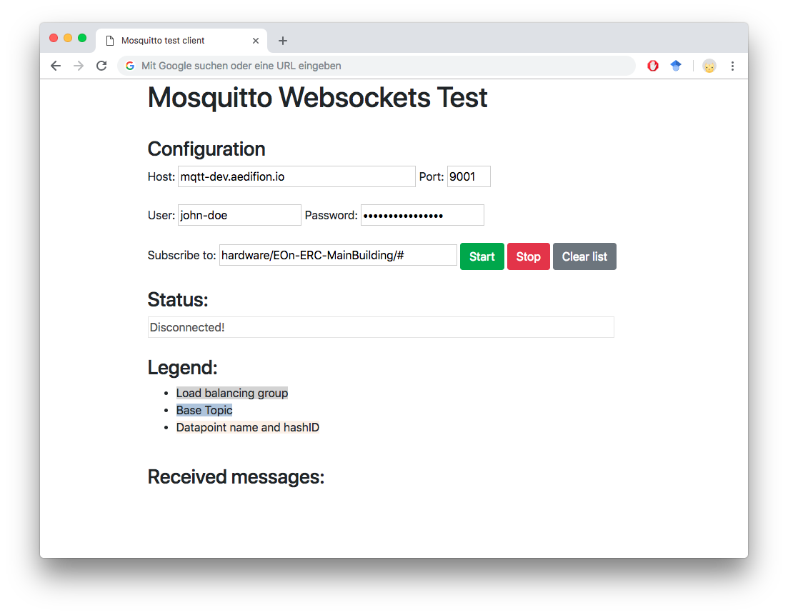
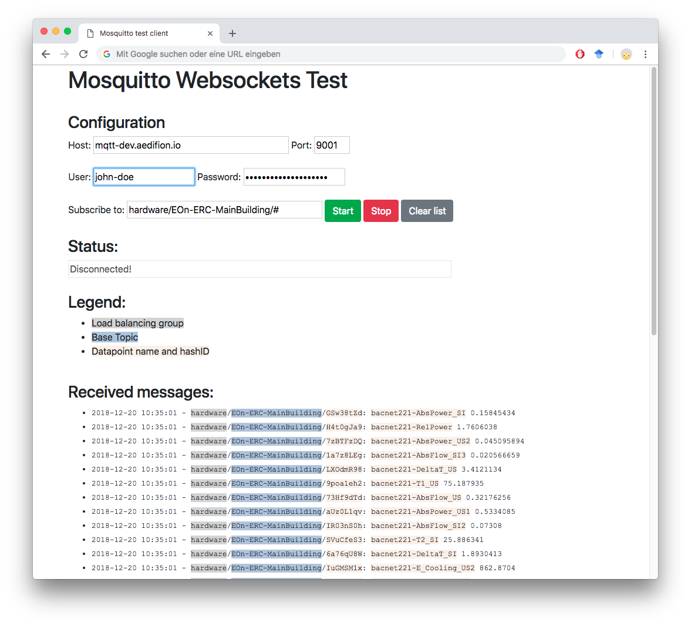

# Websockets

## Overview

In this article, we provide hands-on tutorials for connecting to the MQTT broker of the aedifion.io platform via websockets. This allows, e.g., streaming live-data into websites, plots, and other applications. We show how to build a [small demo website](websockets.md#demo-website) using JavaScript that displays live data received from the MQTT broker.

### Preliminaries

The examples provided in this article partly build on each other. For the sake of brevity, boiler plate code such as imports or variable definitions is only shown once and left out in subsequent examples.

To execute the examples provided in this tutorial, the following is needed:

* Valid MQTT subscriber credentials \(username and password\) to the aedifion.io MQTT broker. If you do not have a login yet, please [contact us](../../contact.md) regarding a demo login. The login used in the example will not work!
* A project with live data ingress.

## Demo Website

In this section, step by step we build a demo website that runs an MQTT subscriber which receives new messages via websockets in real-time and displays these to the user.

The [complete source code](https://github.com/aedifion/mqtt-ws-demo) of this demo is available at Github.

### Frontend

First, we design a very simple frontend.

Open the HTML editor of your choice and start a new document `websockets-demo.html`



```markup
<!DOCTYPE html>
<html>
<head>    
	<meta charset="utf-8">    
	<title>MQTT Websockets Demo</title>    
	<meta name="description" content="An interactive MQTT websockets demo.">
</head>
<body>  
	<h1>Mosquitto Websockets Test</h1>
</body>
</html>
```



This page has a title, a description, and displays a single heading.

#### Getting user's input

The user should be able to specify

* which MQTT broker to connect to,
* which credentials to use for login to the broker, and
* what topic to subscribe to on connect.

The following simple form elements do the trick and come with sane defaults.

```markup
<h3>Configuration</h3>
Host: <input type='text' value="mqtt-dev.aedifion.io" size="40" id='host'> 
Port: <input type='text' value="9001" size="6" id='port'><br><br>
User: <input type='text' value="scasa-demo" size="20" id='username'/>
Password: <input type='password' value="LujZUE4oje7BgyHHhhYo" size="20" id='password'/><br><br>
Subscribe to: <input type='text' value="hardware/EOn-ERC-MainBuilding/#" size="40" id='topic'/>
```

After filling in the address of the MQTT Broker etc., the user should be able to start the subscription, stop it, or clear any written output. We include three buttons for this job.

```markup
<button class="btn btn-success" onclick="connect()">Start</button>
<button class="btn btn-danger" onclick="disconnect()">Stop</button>
<button class="btn btn-secondary" onclick="clearList()">Clear list</button>
```

To make the buttons look nice, we use [Bootstrap's Button classes](https://getbootstrap.com/docs/4.1/components/buttons/) which requires including the Bootstrap CSS and library in the `<head>...</head>` section:

```markup
<link rel="stylesheet" href="https://stackpath.bootstrapcdn.com/bootstrap/4.1.3/css/bootstrap.min.css" integrity="sha384-MCw98/SFnGE8fJT3GXwEOngsV7Zt27NXFoaoApmYm81iuXoPkFOJwJ8ERdknLPMO" crossorigin="anonymous">
<script src="https://stackpath.bootstrapcdn.com/bootstrap/4.1.3/js/bootstrap.min.js" integrity="sha384-ChfqqxuZUCnJSK3+MXmPNIyE6ZbWh2IMqE241rYiqJxyMiZ6OW/JmZQ5stwEULTy" crossorigin="anonymous"></script>
```

This step only displays the buttons. But we still have to fill them with life by implementing the specified functions that are called for the`onclick` events, i.e., `connect()`, `disconnect()`, and `clearList()`.

#### Providing feedback

We should provide feedback about the current connection status to the user. To this end, we include a simple form field which we update with the current status when it changes. At the start, we are _disconnected_ from the MQTT broker.

```markup
<h3>Status:</h3>
<input type='text' id='status' size="80" value="Disconnected!" disabled />
```

#### Displaying received messages

Finally, we need to display the received messages to the user. We choose a simple list to which we will append the messages when they are received.

```markup
<h3>Received messages:</h3>
<ul id='messages' style="font-family: 'Courier New', Courier, monospace;"></ul>
```

We will later show how to parse and highlight specific parts of the message. For now, let's include a colored legend for the parts we wish to highlight.

```markup
<h3>Legend:</h3>
<ul>
    <li><span style='background-color: LightGray; font-size: 1rem'>Load balancing group</span></li>
    <li><span style='background-color: LightSteelBlue; font-size: 1rem'>Base Topic</span></li>
    <li><span style='background-color: Linen; font-size: 1rem'>Datapoint name and hashID</span><br><br></li>
</ul>
```

The final masterpiece looks similar to this.



### Implementation

So far, we have only designed the frontend but still needs to implement its logic. For this task, we rely on two libraries

* [mqttws31.js](https://cdnjs.cloudflare.com/ajax/libs/paho-mqtt/1.0.1/mqttws31.js):  The [Eclipse Paho Javascript client](https://www.eclipse.org/paho/clients/js/#), a MQTT client written in JavaScript.
* [jquery-3.3.2.min.js](https://code.jquery.com/jquery-3.3.1.min.js): The compressed version of the popular [JQuery JavaScript library](https://jquery.com/).

which we include in the `<head> ... </head>` section of the page with the following snippet:

```markup
<script type="text/javascript" src="https://cdnjs.cloudflare.com/ajax/libs/paho-mqtt/1.0.1/mqttws31.js"></script>
<script type="text/javascript" src="jquery-3.3.1.min.js"></script>
```

The two included libraries are a good start, but we will of course need some logic of our own. For the sake of clarity, we put all of our own additional JavaScript code into a separate file that we include in the HTML.

```markup
<script type="text/javascript" src="mqtt-ws-demo.js"></script>
```

#### Connecting

When the user clicks on _Start,_ we need to connect to the MQTT broker and subscribe to the desired topic. 

First, we get _host_ and _port_ from the form elements and create a MQTT client. We then have to specify what happens, when a message is received. This event is handled by setting an adequate callback that we still have to implement. Finally, we connect the client to the broker by providing username and password from the form elements. We also enable TLS and configure a callback for the `onSuccess` event. 

```javascript
function connect() {   
	host = $('#host').val();
	port = $('#port').val();       	
	client = new Paho.MQTT.Client(String(host), Number(port), "websockets-test-client");

	client.onMessageArrived = cb_onMessageArrived;

    options = {
        onSuccess: cb_onConnect,
        useSSL: true,
        userName: $('#username').val(),
        password: $('#password').val()
    };
	client.connect(options);
}
```

#### onConnect

When the client has successfully established a connection, the `onSuccess` event is triggerd and our callback `cb_onConnect` is called. The implementation is very simple. We sets the status field and tell the client to subscribe to the desired topic.

```javascript
function cb_onConnect() {
    $('#status').val('Connected to ' + host + ':' + port);
    client.subscribe($('#topic').val());
}
```

#### onMessageArrived

After having subscribed to one or more topics, the client will start to receive messages. Each new message triggers an `onMessageArrived` event and thus a call to our callback `cb_onMessageArrived`passing the received message as a function parameter.

Message have two important attributes:

* `destinationName` The topic to which the message was sent.
* `payloadString` The payload of the message.

The following function parses both topic and message and highlights specific parts. At the end, the highlighted and reformatted message is prepended to the list of messages.

```javascript
function cb_onMessageArrived(message) {
	var topic = message.destinationName.split("/");
	var colored_lbg = "<span style='background-color: LightGray'>" + topic[0] + "</span>"
	var colored_topic = "<span style='background-color: LightSteelBlue'>" + topic[1] + "</span>"
	var colored_hashid = "<span style='background-color: Linen'>" + topic[2] + "</span>"
	var payload = message.payloadString.split(";");
	var colored_dp = "<span style='background-color: Linen'>" + payload[0] + "</span>"
	var dt = payload[1].split("T")
	dt = dt[0] + ' ' + dt[1].split("Z")[0].split(".")[0]
	
	$('#messages').prepend('<li><span style="font-size: 0.8rem">' + dt + " - " + colored_lbg + '/' + colored_topic + '/' + colored_hashid + ": " + colored_dp + ' ' + payload[2] + '</span></li>');
}
```

#### Disconnecting

When the user has seen enough messages, he/she should be able to disconnect. The function is very simple. We first call `disconnect()` on the MQTT client then update the status field.

```javascript
function disconnect() {
	client.disconnect();
	$('#status').val("Disconnected!")
}
```

#### Clearing all messages

With JQuery, clearing all message is even simpler than disconnecting.

```javascript
function clearList() {
	$('#messages').empty();
}
```

### Running the demo

Configure the MQTT broker, provide valid credentials, and choose a topic. Then hit _Start_. You will soon see messages dropping in.




